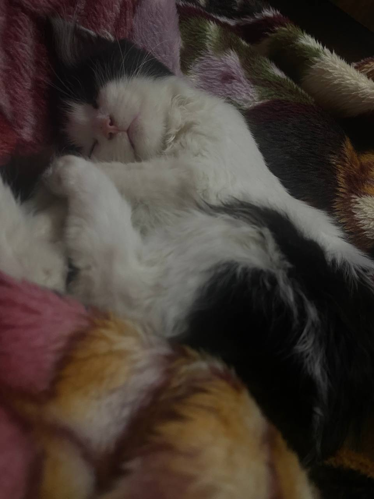
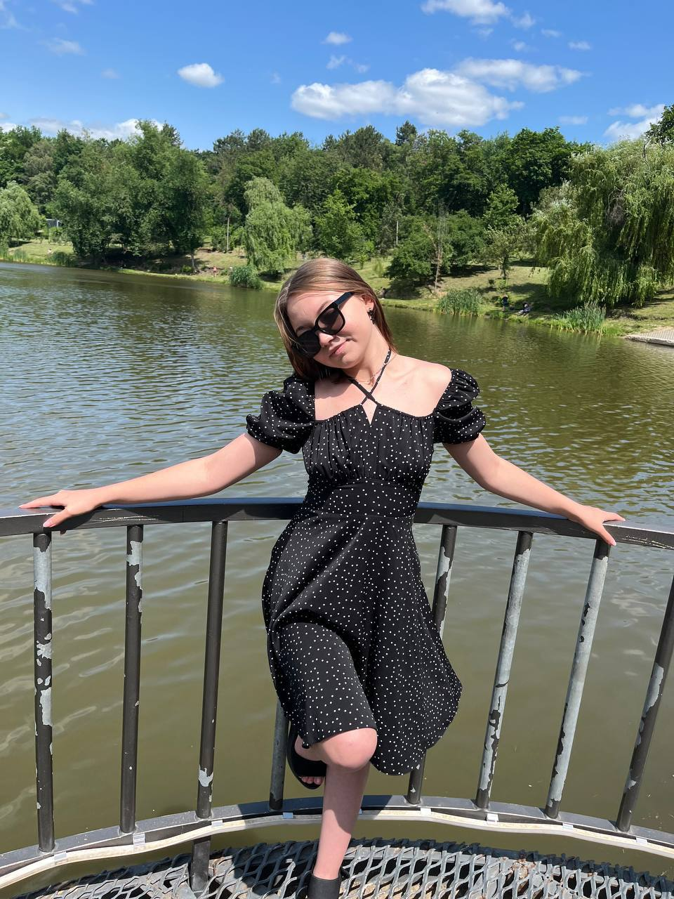
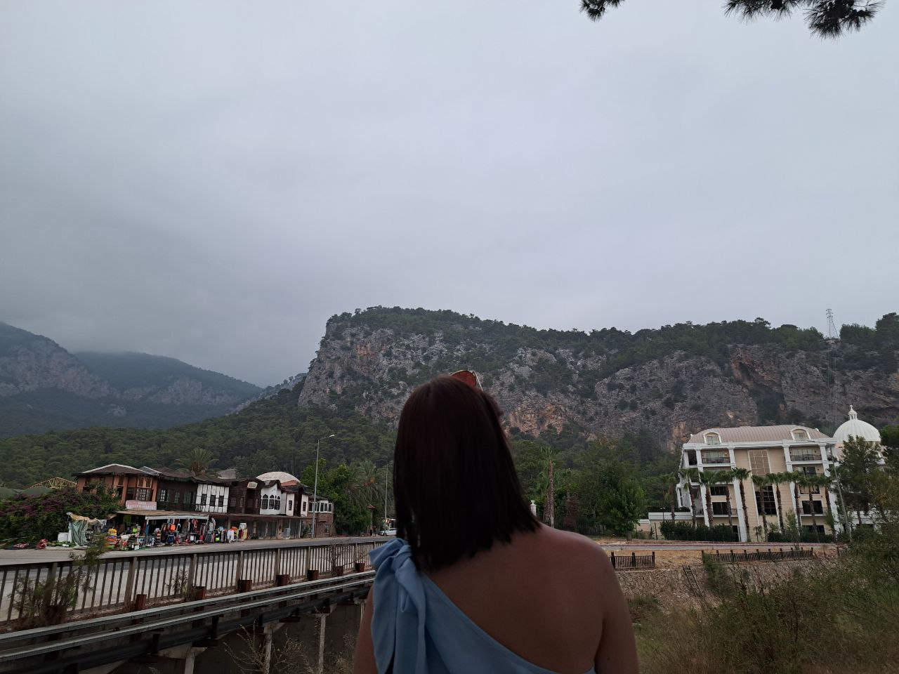

# Привет!❤️

Меня зовут Дарья.
Я студентка государственного университета Молдовы, изучаю **программирование** и увлекаюсь **дизайном**.

##  О себе
Я почти дружелюбный человек, который любит творить и создавать что-то новое.  
Рисование помогает мне расслабиться, убрать стресс и находить вдохновение для учебы и работы.  
Моя цель — развиваться в области дизайна и веб-разработки. Я уже начала писать сайты, разрабатывать логотипы и дизайны приглашейний, визиток и т.д.

## Области интересов
- Дизайн приглашений и визиток.
- Веб-дизайн
- Веб-разработка
- Фриланс-проекты
- Рисование
- Музыка 

## Языки программирования

### Знаю:
- HTML
- CSS
- C++

### Изучаю:
- JavaScript

### Хочу изучить:
- Python  

## Контакты
- GitHub: https://github.com/1daria0
- Telegram: @hrustik14
- Email: daragicu2@gmail.com
